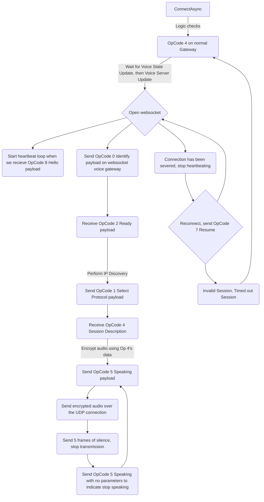

# Contributing
Most of the logic is held within the VoiceNextConnection folder, which is a bunch of files that pertain to the `VoiceNextConnection` class. The logic flow looks a little like this:



The methods below are mapped out accordingly:
```
ConnectAsync -> VoiceNextExtension.ConnectAsync(DiscordChannel voiceChannel, bool muted, bool deafened)
Send Voice State Update (OpCode 4) -> VoiceNextExtension.ConnectAsync()
State and Server update -> VoiceNextExtension.ConnectAsync/HandleVoice{State, Server}Update()/VoiceNextExtension.ConnectAsync
Send OpCode 0 Identify payload -> VoiceNextConnection.ConnectAsync()
Connection severed -> VoiceNextConnection.WebsocketClosedAsync()
Reconnect -> VoiceNextConnection.ReconnectAsync()
All OpCode interaction -> VoiceNextConnection.WebsocketMessageAsync()
Send audio -> VoiceNextConnection.SpeakAsync(Stream audioStream, bool reset)
```
